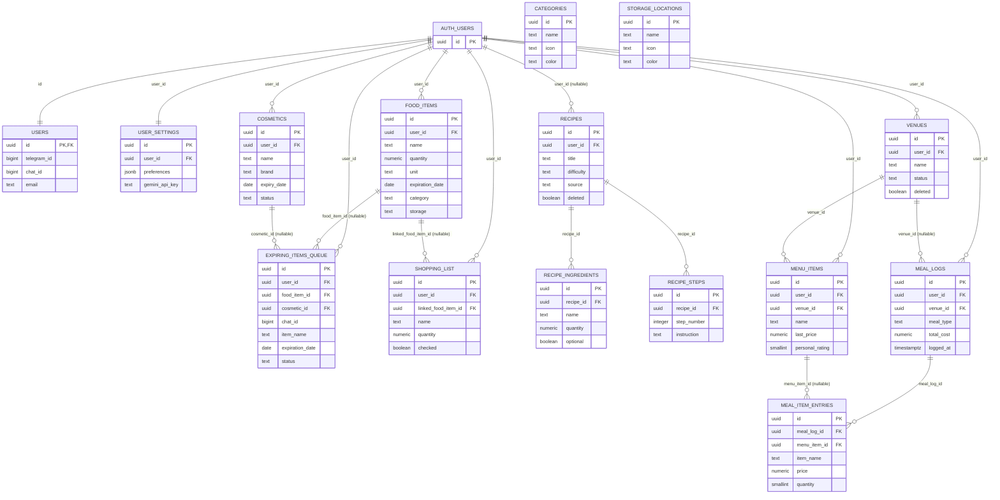

# Database Entity Relationship Diagram

Visual representation of the current `public` schema (Supabase).

## Referential Action Notes

- `CASCADE` delete examples:
  - `expiring_items_queue.food_item_id -> food_items.id`
  - `expiring_items_queue.cosmetic_id -> cosmetics.id`
  - `recipe_ingredients.recipe_id -> recipes.id`
  - `recipe_steps.recipe_id -> recipes.id`
  - `meal_item_entries.meal_log_id -> meal_logs.id`
- `SET NULL` delete:
  - `shopping_list.linked_food_item_id -> food_items.id`
- Many auth-linked FKs are `NO ACTION` on delete; some are `CASCADE` (see `relationships.md` matrix).

## Non-FK Logical References

- `food_items.category` logically references category names in `categories`
- `food_items.storage` logically references names in `storage_locations`
